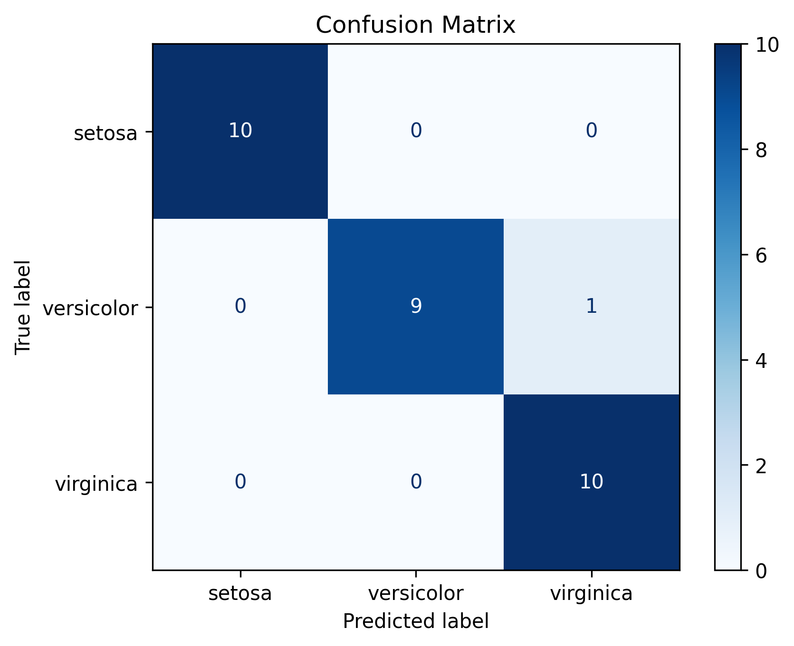

# 🌸 Neural Network from Scratch

This project implements a **fully-connected feedforward neural network** in pure **NumPy** to classify the famous [Iris dataset](https://archive.ics.uci.edu/ml/datasets/iris).  
No machine learning libraries (TensorFlow, PyTorch, Scikit-Learn) are used – only **NumPy** and **matplotlib**.

---

## 🚀 Features
- Custom implementation of:
  - Forward propagation (ReLU, Sigmoid, Threshold functions)
  - Backpropagation with gradient descent
  - Weight & bias initialization
- Train/test data split
- Performance evaluation:
  - Total Error (MSE)
  - Accuracy
  - Confusion matrix visualization
  - Loss curve over epochs
- Educational comments explaining **how neural networks learn**

---

## 📊 Dataset
The [Iris dataset](https://archive.ics.uci.edu/ml/datasets/iris) contains **150 samples** of iris flowers, each described by 4 features:

- Sepal length  
- Sepal width  
- Petal length  
- Petal width  

Each sample belongs to one of three species:
- *Iris Setosa* 🌱  
- *Iris Versicolor* 🌿  
- *Iris Virginica* 🌸  

---

## 🧠 Neural Network Architecture
- **Input layer:** 4 neurons (flower measurements)  
- **Hidden layer:** 5 neurons with ReLU activation  
- **Output layer:** 3 neurons (one-hot encoded classes)  
- **Activation:** Sigmoid for outputs during training, Threshold for final classification  

---

## 📈 Training
The network is trained with **gradient descent**:

- Loss function: Mean Squared Error (MSE)  
- Learning rate: configurable (default `0.05`)  
- Epochs: up to `100000` (stops early if error < `0.001`)  

### Example: Loss Curve

---

## ✅ Evaluation
After training, the model is tested on unseen data (20% split).  
Metrics include:  
- **Accuracy** (correct predictions / total samples)  
- **Confusion Matrix**:

